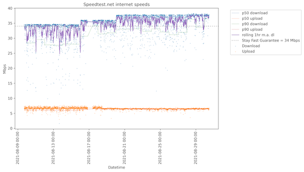

# speedtest

## Summary
* Simple script to automate the capturing of internet upload and download speeds, and the vizualization in a chart

## Requirements
* Linux-like environment with crontab
  * Tested on 
    * Raspbian GNU/Linux 10 (buster)
    * macOS 10.14.6
* Python
  * Tested on 3.7.3
  * Libraries
    * pandas
    * matplotlib


## Installation / Set-up
* (Recommended) set up Python virtual environment (e.g https://docs.python.org/3/library/venv.html)
  * This will keep this project isolated from your other enviroments ad will minimise the process crashing is packages/versions are updated elsewhere
* Ensure the appropriate python libraries are installed (see requirements.txt)
  * It's really just pandas and matplotlib that you will need
* Copy repo to local env in your preferred method (git clone is recommended)
  * alternatively, manually create the following files in your preferred location (these are the core 2 files you'll need)
    * speedtest.sh
    * speedtest.py
* Create a new entry in crontab
  * From command line:
    * crontab -e
  * this will open crontab in your preferred editor, I use vim)
  * add the following entry:
`*/5 * * * * /home/pi/Projects/speedtest/speedtest.sh > /dev/null 2>&1`
  * The `*/5` sets up a schedule for every 5 mins - this can be modifed to whatever you want
  * The `> /dev/null 2>&1` just redirects stout and sderr to the null device.  Alternatively you could redirect to a logfile such as `>> speedtest.errorlog` instead if you want
* (Recommended) update paths used in the `.sh` script to absolute paths
  * crontab is usually run as root, so may not know which binaries to use
  * using absolute paths gets around this
  * to find the absolute paths you cand do `which sudo` or `which python3` etc.    
* Test script locally
  * `./speedtest.sh`
    * This should take approx 1 minute depending on your connection, and create/append results in `speedtest.log`
    * verify you have some output in the file - e.g. `cat speedtest.log` to print the contents to stout
  * `python3 speedtest.py`
    * This should generate/update the speedtest.png, and takes a couple seconds
* (Optional) Set up a webserver like Apache or nginx
  * This means you can access the `.png` file from anywhere on your network/vpn by directly entering your ip-address to the host from a browser
  * To do this, once the webserver is set up, I additionally copy the python-generated png in the `.sh` script to /var/www/html directory (this will depend on your webserver)
  * Save index.html as index.html_old, and create new index.html file with the following code:

```
<html>
         <div class="imgWrapper">
                 
         </div>
         <p>some text</p>
 
 </html>
 ```
 
 
 ## Future enhancements
 * Make installer / package to automate handling paths/directories etc
 * Add unit tests
 * Add code comments
 * Direct logs to different logfile
 * Better charting with rolling window
